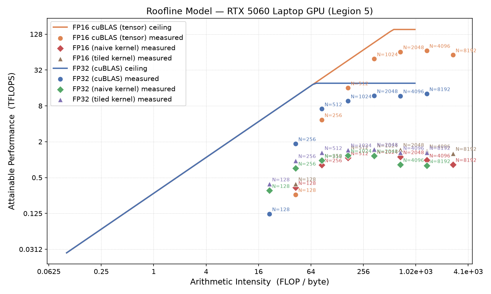

# 01 matmul roofline

square matmul benchmark on the 5060, measured tflops plotted against the theoretical roofline so i can see how close i actually get to the ceiling and where the crossover from memory bound to compute bound sits.

## what it does

sweeps square matmul across sizes for fp32 and fp16, times each with cuda events, converts to tflops and arithmetic intensity, and plots the points under the roofline. the fp16 path uses cublasGemmEx with tensor ops.

## results

peak i measured on this card:

- fp32: ~12.8 tflops
- fp16: ~68 tflops (tensor cores)



small matrices sit down on the memory bound slope, they never get near peak because arithmetic intensity is too low. big matrices flatten out under the compute ceiling.

## run

```
make
./roofline > roofline.csv
python3 plot_roofline.py roofline.csv
```

needs the cuda toolkit and cublas. plotting needs matplotlib.
