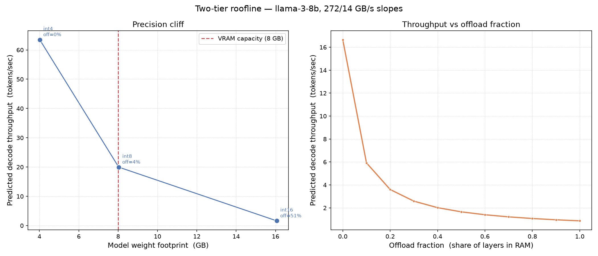
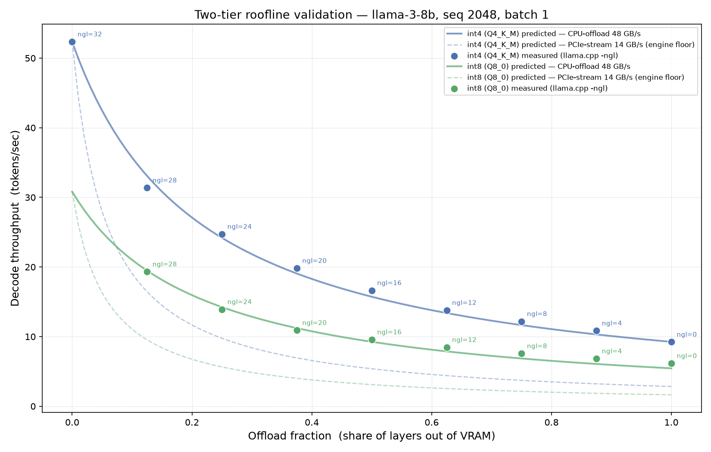
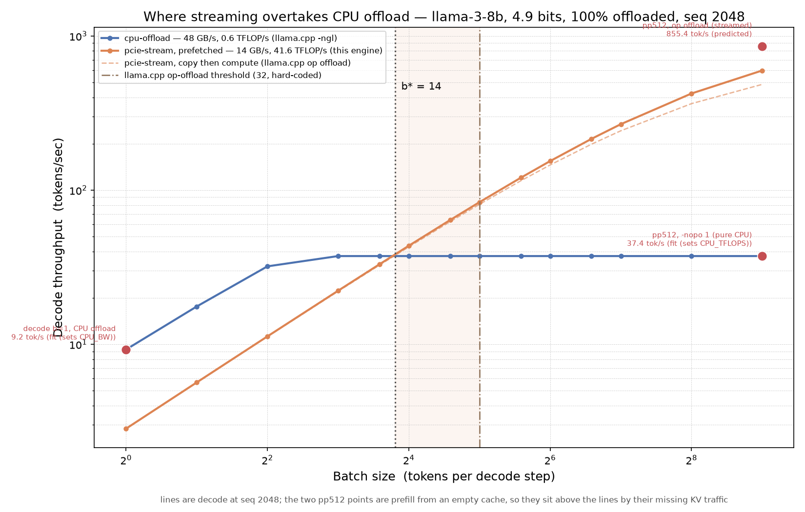

# 03 inference engine

in progress. this is the capstone. the tier roofline (steps 1-2b) is done and validated against llama.cpp — including the batch axis, where it predicts the tier crossover at **b\* = 14** against llama.cpp's default of 32. that prediction has since been **measured at 15.5** with a drift-controlled a/b sweep, worth **1.5x prefill throughput**, and shown to move to **28.7 under q8_0** — filed upstream as [llama.cpp #27425](https://github.com/ggml-org/llama.cpp/issues/27425). the runner floor (step 3) generates tokens. step 4, the quantized gemv, is done through w8a16: int8 weights with dequant fused in-register run 1.9-2.0x the fp16 baseline, which itself sits at 85-101% of the measured bandwidth ceiling. fp8 e4m3 is next.

## what it is

an inference engine for an 8gb laptop card that runs models **bigger than its own vram**, by deciding what lives in vram, what lives in system ram, and when to move it.

the deliverable is the engine: a server that unifies vram and system ram into one space so a model too big for the card runs at all. still in progress, but the **two tier roofline** already predicts the payoff — quantized to 4-bit, llama 3 8b runs near 60 tokens/sec fully resident, while the full 16-bit version still runs but crawls to ~1.6 tok/s on this card as half its weights spill across pcie (~3 tok/s on a gen4 x16 link that offloads only ~25%; see the measured table below). the roofline is the tool that says which optimization pays; the engine is what delivers it.

## the wall, and why offload changes its shape

decode is memory bound. to make one token you stream every weight in the model out of memory, do a trivial amount of arithmetic with each one, and throw it away. roughly 1-2 flops per byte, so you sit pinned to the 272 gb/s ceiling with the compute units idle. a faster kernel does nothing. the kernel is already at the ceiling.

now make the model too big to fit. the spilled layers go to system ram, which is not on the fast road, it's across pcie — measured at **14 gb/s** on this laptop's gen4 x8 link (the 16-32 range assumes x16; step 0 pins the real number). **an offloaded layer is ~20x slower to stream than a resident one here (272 vs 14 gb/s).**

so there is no longer one roofline, there are two:

```
decode time  ~=  bytes in vram / 272 gb/s  +  bytes in ram / 14 gb/s   (measured, gen4 x8)
```

the second term swamps the first almost immediately, and that changes what optimization means.

### the cliff

**quantization's payoff is not linear in bytes, it's a step function at the vram boundary.**

while the model already fits, int8 halves the traffic and buys you ~2x. fine. but if quantizing is what stops the model spilling *at all*, you don't get 2x, you get 5-10x, because you deleted the pcie term from the equation. the win came from crossing a boundary, not from moving fewer bytes.

8gb puts that cliff exactly where it can be studied. llama 3 8b: fp16 is ~16gb and spills badly, int8 is ~8gb and sits on the knife edge, int4 is ~4gb and fits with room for kv cache. the cliff is sweepable on hardware i already own.

### measured on this machine (step 0)

legion 5, rtx 5060 laptop (blackwell gb206), wsl2. the pcie slope is measured, not spec'd: pinned host-to-device tops out at **14 gb/s**, and the link negotiates **gen4 x8** (the silicon can do x16, the laptop wires x8), so 14 is ~89% of the gen4-x8 ceiling — a healthy link, just half the lanes. pinned barely beats pageable (14 vs 13), which is its own wsl2 finding: the page-locked advantage async prefetch leans on is thin here.

feeding 272 / 14 gb/s into the roofline, decode throughput for llama-3-8b (fp16, seq 2048) vs how much of the footprint spills:

| offload | tok/s | when it happens |
|--------:|------:|-----------------|
|   0%    | 16.7  | fits entirely in vram (needs a bigger card or lower precision) |
|  10%    |  5.9  | |
|  25%    |  3.0  | 12 gb-class card, or a gen4 x16 link |
|  40%    |  2.0  | |
| **51%** | **1.6** | **8 gb card, full fp16 — the forced floor: 16.3 gb footprint can't keep more than 8 gb resident** |
| 100%    |  0.9  | pure pcie |

the takeaway the table makes concrete: on the 8 gb card fp16 *has* to offload ≥51%, so ~1.6 tok/s is its floor here; the ~3 tok/s figure is the same model at ~25% spill, which needs a 12 gb card or a gen4 x16 link. int4 sidesteps all of it — 4.3 gb fits, 0% offload, ~63 tok/s.



left panel is the cliff: throughput against model footprint, with the 8 gb vram boundary as the vertical line — int4 sits left of it and runs at the vram slope, fp16 sits right and falls onto the pcie slope. right panel is the same prediction as a continuous curve over offload fraction, which is the line step 2 overlays real measurements onto.

```
python3 -m roofline.roofline2
```

### step 2: does the curve land? (validated)

swept `-ngl` 0→32 on llama-3.1-8b, int4 (q4_k_m, 4.9 gb) and int8 (q8_0, 8.5 gb), seq 2048, batch 1, decode timed with `llama-bench -d 2048` so the kv cache is full. each predicted line is drawn at the gguf's real on-disk bits/param (q4_k_m is 4.9, not 4.0). int4 lands within **±6%** across the whole offload sweep; int8 within **±11%**, worst at the fully-offloaded end. the split matters: the 48 gb/s slope is fitted on int4's ngl=0 point, so int4's fit is partly by construction and int8's curve is the out-of-sample one. the model holds on both, but int8 is the honest number to quote.



but they land on a slope of **48 gb/s, not 14** — and that's the finding. llama.cpp's `-ngl` doesn't stream offloaded weights over pcie. it runs those layers *on the cpu*, out of system ram (ddr5, ~48 gb/s measured off the ngl=0 endpoint); only the activations cross pcie. so there isn't one offload tier, there are two:

- **cpu-offload** (~48 gb/s) — offloaded layer computed on the cpu. what llama.cpp does, and what the solid lines predict.
- **pcie-stream** (14 gb/s) — offloaded weights shipped to the gpu to compute there. what *this* engine does. the dashed lines, the floor naive streaming would sit on.

the 14 gb/s in "the wall" above is still the right number for the engine's streaming path — it just isn't the number llama.cpp pays. both are real, they're different mechanisms.

and the gap is why this matters instead of being a footnote: **at batch 1 cpu-offload (48) beats naive pcie-streaming (14) by 3.5x.** streaming to the gpu is a *losing* move at batch 1 — the engine only gets ahead once batching hides the pcie copy behind compute and the fast gpu takes over. the baseline being stronger than the naive floor is exactly what forces the next section.

**llama.cpp already streams, and finding that out is what made this project sharper.** the first draft of the paragraph above said "streaming to the gpu is what *this* engine does" as though nobody else did it. that's wrong. `ggml/src/ggml-backend.cpp:961`: when an op's weights sit in a host buffer, the scheduler offers the op to a higher-priority backend, and `ggml/src/ggml-cuda/ggml-cuda.cu:5336` takes it whenever `get_op_batch_size(op) >= op_offload_min_batch_size`. that threshold **defaults to 32** at `ggml-cuda.cu:5507`, overridable with `GGML_OP_OFFLOAD_MIN_BATCH` — a knob a human sets, not a number the engine derives. it's a token count on the ubatch, not a phase check — so it fires on prefill *and* on batched decode, and never at batch 1.

measured on q4_k_m, both at `-ngl 0`, so the layer placement is identical and only the tier differs:

| run | tok/s | what's running |
|---|---:|---|
| `-p 512 -nopo 1` | 37.4 | pure cpu compute — the cpu's ceiling, **0.60 tflop/s** |
| `-p 512` (default) | 855.4 | weights streamed over pcie, gpu computes |

**23x, from the same weights in the same place, by choosing a different tier.** so the contribution isn't the mechanism, it's the policy: 32 is a constant somebody picked, not a number derived from a bandwidth, a flops ceiling or a tensor shape. writing down the equation it approximates is the thing nobody has done.

(int8 has no 0%-offload point: at 8.5 gb it can't sit fully resident on 8 gb, so `-ngl 32` oversubscribes vram and the driver falls back to shared memory — dropped as an artifact. that unreachable corner is the cliff, live.)

**reproduce.** the plot regenerates from the committed `roofline/sweep_results.json` with matplotlib alone:

```
python3 -m roofline.validate_llamacpp
```

to re-run the sweep itself (`--resweep`) needs llama.cpp built with cuda and the two ggufs (paths are set at the top of `validate_llamacpp.py`):

```
# llama.cpp, cuda, blackwell sm_120
git clone https://github.com/ggml-org/llama.cpp && cd llama.cpp
cmake -B build -DGGML_CUDA=ON -DCMAKE_CUDA_ARCHITECTURES=120
cmake --build build --target llama-bench

# models (pip install huggingface_hub)
hf download bartowski/Meta-Llama-3.1-8B-Instruct-GGUF \
  Meta-Llama-3.1-8B-Instruct-Q4_K_M.gguf Meta-Llama-3.1-8B-Instruct-Q8_0.gguf \
  --local-dir ~/models
```

### why batching comes back

offloading naively serialises: copy layer i, compute layer i, copy layer i+1, compute layer i+1. the fix is to prefetch layer i+1 on a separate cuda stream while the gpu computes layer i. if compute time >= transfer time the copy is free, fully hidden.

but **at batch 1 there is almost no compute to hide behind.** that's the whole point of decode being memory bound. so prefetch buys nearly nothing.

what manufactures compute to hide the transfer behind? **batching.** not to serve many users, there's only one user here. to raise arithmetic intensity until the pcie copy disappears under the math.

### three tiers, and the one that scales

step 2 split "offload" into two different mechanisms, so a spilled layer has three possible homes, not two:

| tier | weights live | compute happens | slope | cost as batch b grows |
|------|--------------|-----------------|------:|-----------------------|
| resident | vram | gpu | 272 gb/s | flat |
| cpu-offload | system ram | **cpu** | 48 gb/s | **grows with b** |
| pcie-stream | system ram | **gpu** | 14 gb/s | **flat in b** |

that last column is the whole argument, and it does not follow from the slopes.

**cpu-offload** streams each weight out of ddr5 exactly once, then the cpu does all b tokens' arithmetic with it. at b=1 that arithmetic is trivial and the tier is purely bandwidth bound — which is exactly why the 48 gb/s slope fits llama.cpp to ±6%. as b rises the arithmetic stops being trivial and the cpu's own flops become the binding term instead of ddr5. **cost per token stops falling and starts rising.**

**pcie-stream** moves the same bytes no matter what b is — the transfer is a property of the weights, not of the batch. meanwhile gpu compute grows with b, so the copy gets progressively easier to hide, and past some point it disappears under the math entirely. **cost per token is flat in b, then free.**

one curve rising, one flat, starting 3.5x apart at batch 1. **they cross.** that crossover batch size b\* is a specific number on this machine:

> below b\*, cpu-offload wins and streaming to the gpu is the losing move. above b\*, streaming wins and a fixed `-ngl` layer split is leaving throughput on the table.

this section used to end by admitting that b\* was hand-waving, because the cpu's *compute* ceiling had never been measured and b\* is precisely where that ceiling binds. step 2b measures it.

### step 2b: the batch axis, and where the tiers cross

steps 1-2 measured one point on this axis — batch 1 — which is the single batch where the answer is uninteresting, because every tier is bandwidth bound there and the fastest bandwidth wins. the model had no compute term at all, so it *couldn't* have said anything else. adding one needs two ceilings that were never measured, and now are:

| ceiling | value | how |
|---|---:|---|
| cpu compute | 0.60 tflop/s | `-ngl 0 -nopo 1 -p 512` → 37.4 tok/s × 2 × 8.03e9 |
| gpu compute | 41.6 tflop/s | `-ngl 99 -p 512` → 2592 tok/s |

**69x apart.** that ratio is the engine's entire thesis, and it's why the two tiers can't stay parallel:

- **cpu-offload** reads each weight out of ddr5 once and then does b tokens of math with it. bandwidth bound at b=1 (108 ms of ddr5 vs 27 ms of math), **compute bound by b ≈ 3.8**, and flat at 37 tok/s forever after. more batch buys nothing.
- **pcie-stream** moves the same weight bytes no matter what b is. gpu compute only catches the copy at b ≈ 910, so in any practical range the tier is copy-bound and throughput climbs *linearly*.

one flattens, one climbs, so they cross:

> **b\* = 14.** below it llama.cpp's cpu tier is genuinely the right call and streaming loses. above it streaming wins and keeps winning.



**and llama.cpp switches at 32.** so between batch 14 and 31 it stays on a tier its own hardware says it should have left — costing up to **2.2x** at b=31. that band is not a hypothetical: it's where a single-user local engine with a few parallel requests, or speculative decoding, actually lives.

the model earns the prediction by making one out-of-sample call first. `CPU_TFLOPS` is fitted on the 37.4 point and `CPU_BW` on the batch-1 decode point, but nothing about the streamed run is fitted — it's the 14 gb/s pcie slope from step 0 plus the gpu ceiling, added rather than maxed because llama.cpp's op offload copies then computes (the weight is a graph-split input, recopied every eval behind a `ggml_backend_synchronize`, `ggml-backend.cpp:1554-1580`):

```
pp512, op offload   measured 855.4 tok/s   predicted 836.4   -2.2%
```

which also prices the thing step 5 is for — and the price is batch dependent in a way worth being careful about. prefetching only recovers the compute that was serialised behind the copy, so it pays exactly where there's compute to hide:

| | serialised (baseline) | prefetched | gain |
|---|---:|---:|---:|
| pp512 (prefill) | 612 ms | 415 ms | **1.48x** |
| decode b=32, seq 2048 | 395 ms | 383 ms | 1.03x |
| decode b=64, seq 2048 | 439 ms | 415 ms | 1.06x |

so **prefetch is a prefill/large-batch optimisation, not the decode win.** in the 14-32 band the entire gain comes from picking the right tier, not from overlapping the copy. worth knowing before spending a month on a copy-stream pipeline for step 5.

```
python3 -m roofline.batch_crossover
```

**b\* has since been measured directly.** an alternating always/never op-offload sweep (configs interleaved across repetitions so thermal drift cannot favour either) puts the q4_k_m crossover at **15.5** against the predicted 14, flat in `-ngl` (8/16/24 -> 15.3/15.5/15.6), and moves it to **28.7** on q8_0 -- roughly the bytes-per-weight ratio, which is the argument that no fixed default can be right. lowering the threshold is worth **1.50x** at pp24 (116.6 vs 77.6 tok/s, drift-controlled means). filed upstream as [#27425](https://github.com/ggml-org/llama.cpp/issues/27425). note the model runs ~10-15% low in both quants, so quote it as "predicted 14, measured 15.5", not as an exact hit. what is still modeled and not measured: batched *decode* specifically, which needs `llama-batched-bench -npl 1..64`; the sweep above is prefill.

### so the policy is an argmin, not a blend

knowing b\* turns placement into a decision rule. it isn't a blend of the two engines, it's an **argmin over three tiers, per layer, under a vram budget.** per *layer* because layers aren't uniform — the mlp tensors are ~2.5x the attention projections, so they carry different transfer/compute ratios and land on opposite sides of b\*. one global threshold of 32 cannot be right for both.

and placement needn't be integer. split a single weight matrix **by rows** — some rows resident, some streamed — and the offload fraction becomes continuous instead of stair-stepped, which is what turns the prediction from an approximation into a fit. finer grained than anything `-ngl` exposes.

### the catch, stated up front

**b\* = 14, which is greater than 1.** at batch 1 — the actual local single-user case — cpu-offload wins and this engine's streaming path *loses*, by 3.5x. that isn't a bug to fix, it's a consequence of decode having no compute to hide behind, and it constrains what the result can be:

- the headline is a **throughput curve over batch size with a crossover on it**, not a latency win at batch 1. claiming the latter would require beating llama.cpp in the one regime where the physics says it's already right.
- the only ways a single local user manufactures batch > 1 are parallel sampling and **speculative decoding**. so step 9 is not a stretch goal — it's what makes the hybrid pay off for the use case that motivated the project.

which means the whole project collapses into one argument:

> model doesn't fit -> offload -> now there are three tiers, not one -> they rank differently at different batch sizes -> raise arithmetic intensity until the fast tier wins -> that is exactly what quantization and batching do

three escapes from the memory wall, all in service of one goal, on one machine. that's the paper.

## the contribution

not a new algorithm. offloading is well trodden (flexgen, headinfer, specoffload) and every serious engine already has paging and continuous batching (vllm, sglang, exllamav3, mlc). **not claiming to have invented any of it.**

what doesn't exist is the model. everyone who runs local models hits this cliff and reasons about it by folklore ("just fit it in vram"), and even the good engines encode the answer as a constant — llama.cpp's tier switch is the literal integer 32, identical on a gen4 x8 laptop and a threadripper with an a100, identical for a 4096×14336 mlp tensor and a 4096×1024 attention projection. nobody writes down the equation that constant is approximating and checks it. so:

> given a bandwidth budget, a vram budget, a batch size and a sequence length: where does the cliff sit, which knob should you reach for, and does the roofline predict the answer before you run it?

**and specifically: where is b\*?** the two engines that bracket this problem each pick one tier and stay there. llama.cpp is cpu-offload with a static, hand-chosen split and no batch-size awareness (`-ot` / `--n-cpu-moe` add per-tensor control, but a human still picks it). flexgen solves a real placement problem, but assumes gpu-compute-only, targets 175b throughput on datacenter cards, and explicitly doesn't care about latency. the hybrids that *do* split compute across cpu and gpu — powerinfer (hot/cold neurons), fiddler and ktransformers (moe experts on cpu) — key the decision on activation sparsity or moe structure, not on a bandwidth crossover in a dense model.

so the gap isn't "nobody has built a hybrid" — llama.cpp even streams to the gpu already, it just switches on a constant a human picks (32 by default). it's that **nobody has written down where the tiers actually cross**, which is the number that tells you which hybrid to build. that's a measurement, it's cheap, step 2b takes it, and it turned out to be **15.5 rather than 32** on this machine.

concretely, three claims, each falsifiable on hardware i own: (1) the tier switch is a function of four measured numbers and the tensor's shape, not a constant — predicted at **14** against a default of 32, **measured at 15.5**, and **28.7 under q8_0**, which tracks bytes per weight (9.1 vs 4.9 bits/param is 1.86x; 28.7/15.5 is 1.85x) and is the argument that no fixed default and no per-machine cache can be right; (2) it differs per layer, so no single threshold is right for both the mlp and the attention tensors; (3) prefetching across layers is worth 1.48x at prefill and almost nothing at decode batch 32 — so tier selection, not overlap, is where the decode win is.

**and the delivery mechanism is flags, not an engine.** llama.cpp already has every *mechanism* this needs: `-ngl` for layer count, `-ot` for per-tensor placement by regex, `-ncmoe` for experts, `GGML_OP_OFFLOAD_MIN_BATCH` for the tier switch. what it does not have is a *policy* — nothing tells you what to set them to, so every value is hand-picked and 32 is 32 because someone chose 32. so the deliverable is an **autotuner**: measure four constants, run the roofline, emit the flags. that is validated on the reference implementation everyone already runs, which is stronger evidence than an engine i wrote and tuned myself, and it is a fraction of the code. the engine below is for what flags cannot express: mixed-precision kv per block, continuous batching, speculative decoding.

the mechanism that makes it work is a **tiered, quantized block allocator**. location and precision are both properties of a block, not global settings:

- hot kv blocks: vram, fp16
- aged blocks: demote precision, then evict to ram
- weights: per-layer placement across all **three** tiers (resident / cpu-compute / pcie-stream), chosen by the roofline at the current batch size, prefetched on a copy stream

that composes paging, quantization and offload into one mechanism instead of three bolted together features. and because the weight tier is picked by the model rather than by hand, the policy follows b\* instead of assuming which side of it you're on. that part is mine.

## baselines

three of them, and they answer different questions:

- **`cudaMallocManaged`** - let the driver page-migrate on demand. the *no policy* control. beating it shows a policy beats no policy.
- **llama.cpp `-ngl`** - a fixed, hand-chosen layer split. the state of the practice. beating it is the real claim.
- **vllm** - the ceiling, with speculative decoding **off** so it's like for like. it has mtp/eagle3/dflash and i don't; leaving them on measures the absence of a feature i never intended to build, not the quality of my engine.

everything exposes the same `generate(prompts, max_tokens)` so `bench.py` sweeps them uniformly.

## scope: the claim vs the engine

the full engine (runner, quantized gemv, paged cache, paged attention kernel, scheduler, placement layer) is months of solo work, and paged attention alone is a serious kernel. **most of it is not required to prove the claim.** so the line is drawn here, on purpose, for whichever future version of me is short on time:

**load bearing. no result without these:**

- the two tier roofline itself. it's arithmetic, a couple hundred lines.
- the measurement harness: pcie bandwidth, tokens/sec, bytes moved.
- placement + prefetch. the custom core, the part that is actually mine.
- the tiered block allocator, location and precision per block.

**borrowable. building them teaches me things, but the claim survives without them:**

- the runner. hf already has one and i only need a floor.
- paged attention. start with a contiguous cache and pytorch sdpa. paging only has to exist once memory pressure is real, and flashinfer's kernel is right there.
- the scheduler. static batching is enough to get the throughput curve, continuous batching is a refinement.
- quantized gemv. `torchao` can stand in while the model is being validated. writing the kernel is the fun part, not the load bearing part.

**so the engine is the last thing i build, not the first.** each piece gets added when a measurement demands it, and every addition is justified by a number i already collected.

### the failure mode to avoid

not that any one piece is too hard. it's spending two months on a paged attention kernel, getting blocked or bored, and never writing down the roofline result that was the actually novel bit and would have taken a week.

**steps 0-2 need almost no engine code and are a complete result on their own.** build the cheap result first, then build the engine to make it a strong one.

## build order

**0. measure the machine.** half a day, before any engine code.
- pcie bandwidth, host-to-device, pinned vs pageable (`cudaMemcpy` microbenchmark). **this number is the second slope of the entire project.**
- **pinned memory on wsl2.** async prefetch needs page-locked host memory (`cudaHostAlloc`). wsl2 gpu passthrough has been quirky here. if it can't hit full speed the prefetch mechanism is dead and i need native linux. find out now, not in week six.
- does vllm build on sm_120. blackwell consumer support has been finicky and vllm is the ceiling for everything.
- **cpu sustained gemm throughput at decode shapes.** added after step 2, **done in step 2b**: this is the slope that decides b\*. measured at 0.60 tflops from llama.cpp's own prefill (`-ngl 0 -nopo 1 -p 512` -> 37.4 tok/s), which is a better number than a synthetic gemm sweep would have given, since it is the same code path that sets the tier's throughput. lives in `roofline2.py` as `CPU_TFLOPS`.

**1. two tier roofline** - `roofline2.py`
extend the 01 plot with the pcie slope. predict decode throughput as a function of model size, precision, and fraction of layers offloaded. **this is the artifact. everything below exists to test it.**

**2. validate against llama.cpp** - cheap and high signal — **done, see [step 2 above](#step-2-does-the-curve-land-validated)**
sweep `-ngl` from 0 to all layers on a model that doesn't fit. measure tokens/sec at each point. overlay the prediction from step 1. the curve lands (±6%), and it turned up the cpu-offload-vs-pcie distinction — the "if it doesn't, stop and find out why" case, which is where the second offload tier came from.

**3. model runner** - `runner.py` — **done**
load a model, kv cached greedy generate. the floor. two modes: batch 1, and static batching (pad to longest, wait for the slowest, contiguous max-length kv per sequence). the static mode matters: without it the final chart can only prove "batching helps", which nobody doubts, instead of "my batching is good", which is the actual claim. both paths work; the smoke test asserts the batched slots match batch-1 exactly, since greedy is deterministic. `MODEL_ID` still needs pinning to the roofline's model.

**4. quantized gemv** - `gemv.cu`, `quantize.py`, `bench_gemv.cu` — **fp16 + w8a16 done, fp8 next**
fp16 baseline first so there's a number to beat, then w8a16: int8 weights, fp16 activations, per-channel scales, dequant fused in-register so a weight only ever crosses the bus as one byte. then fp8 e4m3 (sm_120 has native conversion, so int8 vs fp8 is a measurement here, not a guess).

the fp16 kernel is done: one warp per row, `x` staged in dynamic shared memory, warp shuffle reduction, fp32 accumulator, in two variants (scalar `half` loads and `float4` loads). against the 341 gb/s measured pure-read ceiling (384 spec), the vectorized kernel runs 289-345 gb/s, worth 5-31% over scalar and matching or beating cublas on the three smaller shapes. that cleared the gate, so w8a16 followed: int8 weights, `int4` loads (16 weights per load instruction), fp32 accumulate, and the per-row scale applied once after the warp reduction. **1.9-2.0x the fp16 kernel on the four larger shapes** (1.65x on the small `kv_proj`, where 128 blocks cannot fill the gpu), which is the point: at 1 flop/byte, halving the bytes is the whole speedup, and the fused dequant costs one multiply per row instead of one per element. the int8 kernel is checked against cublas run on the *dequantized* weights, so the check sees reduction-order rounding only (3e-4) and the accuracy price of quantizing is reported separately (rel l2 4e-3 on the bench's uniform weights, 8.3e-3 and cos_sim 0.99997 on `quantize.py`'s normal ones). the host quantizer in `bench_gemv.cu` mirrors `quantize.py` exactly, since a rounding mismatch there would look like a kernel bug.

**5. offload + prefetch** - `placement.py`
per-layer placement across vram/ram, double buffered, `cudaMemcpyAsync` on a dedicated copy stream. measure transfer/compute overlap directly. **expect it to disappoint at batch 1** — that's not a bug, it's the 3.5x gap from step 2 showing up in the engine, and it's the finding that motivates step 7. the target is priced: step 2b says overlapping the copy is worth 1.48x at prefill but only ~1.03x at decode b=32, so **placement is the win here and prefetch is the prefill win.** build the tier-selection policy first, then measure b\* on the real engine against the predicted 14.

**what llama.cpp does not do here, checked in the source (`d59d455`, aug 2026).** the ggml scheduler *has* async copy machinery — copy events and n-deep buffering via `GGML_SCHED_MAX_COPIES` — but `ggml-backend.cpp:1806` sets `n_copies = parallel ? MAX : 1`, and `parallel` requires **more than one gpu** (`llama-context.cpp:428`). on a single gpu it is 1. worse, `ggml_backend_cuda_cpy_tensor_async` (`ggml-cuda.cu:2468`) returns false unless *both* ends are cuda buffers, so the ram->vram case never takes the async path at all; it falls back to `ggml_backend_cuda_buffer_set_tensor` (`ggml-cuda.cu:782`), which issues the copy on `cudaStreamPerThread` and then **immediately `cudaStreamSynchronize`s it**. compute runs on a different stream (`cudaStreamNonBlocking`, `common.cuh:1489`), so the two are not stream-serialized — the host-side blocking sync is what serializes them. the gpu idles through every transfer. the only prefetch in the tree is `POSIX_MADV_WILLNEED` at model load, which is disk->page-cache, not ram->vram.

so the overlap is genuinely unbuilt for the single-gpu offload case, and the fix is not "add a copy stream" (there already is a second stream) — it is to stop blocking the host: pin the staging buffer, record an event, and double buffer so layer n+1's copy is in flight during layer n's compute. temper the claim with the honest version: the *mechanism* exists in ggml for multi-gpu pipelining, what is missing is applying it to this path.

**6. tiered paged kv cache** - `paged_cache.py`, `attention.cu`
block allocator where each block carries a location and a precision. attention reads a non-contiguous, mixed-precision cache. at 8gb the cache genuinely runs out, so eviction is a real decision instead of a design doc.

**7. scheduler** - `scheduler.py`
continuous batching. admit and retire requests every step. here batching stops being about serving many users and starts being about generating enough compute to hide pcie behind.

**8. bench + plot** - `bench.py`, `plot_engine.py`
sweep batch size x precision x offload fraction across all systems. record where each one ooms. overlay every measurement on the step 1 prediction. **b\* is the money point on this chart** — the batch size where the pcie-stream line crosses llama.cpp's cpu-offload line.

**9. speculative decoding** — promoted from stretch
the escape that works at batch 1. use the int4 model as its own draft, verify with fp16. prior work exists (ml-specqd, quantspec), build on it, don't re-derive it.

**why it's no longer a stretch:** the hybrid only wins above b\*, and a single local user has no natural batch. speculative decoding manufactures one — verifying k draft tokens in a single forward pass *is* a batch of k, which is arithmetic intensity bought without a second user. without this, the engine's win region is real but nobody local ever enters it.

## layout

kernels in cuda, harness in python. same split as 02: `.cu` files build into one torch extension via `setup.py`.

grouped by deliverable. run scripts from THIS directory as modules so the
cross-package imports resolve, e.g. `python3 -m roofline.validate_llamacpp`.

files marked *todo* don't exist yet.

```
setup.py               builds the cuda extension (top level: sees all kernels)
Makefile               standalone nvcc build + `make ext` for the torch extension

roofline/              deliverable #1: the model + its validation
  roofline2.py         the tier model: bandwidth AND compute ceiling per tier
  validate_llamacpp.py step 2 gate: overlay -ngl measurements on the prediction
  batch_crossover.py   step 2b: sweep batch, find b*, price the prefetch headroom

engine/                deliverable #2: the engine (the part that's mine)
  runner.py            the floor: batch 1 + static batching
  quantize.py          per-channel symmetric int8 scales + the layout contract
  placement.py         todo: three-tier layer placement + prefetch streams
  paged_cache.py       todo: block allocator, location + precision per block
  scheduler.py         todo: continuous batching
  engine.py            todo, mine: ties placement, cache, scheduler and kernels together
  kernels/
    gemv.cu            fp16 / int8 / fp8 fused dequant matvec (fp8 still todo)
    bench_gemv.cu      standalone bandwidth harness, cublas-checked, csv out
    attention.cu       todo: attention over the tiered paged cache

bench/                 ties it together
  bench.py             todo: sweep over all systems
  plot_engine.py       todo: the charts
```

## notes

- per-channel scales, not per-tensor. per-tensor is easier and loses more than it needs to.
- quality side: perplexity delta vs fp16 on wikitext, so every latency win carries a price tag.
- unified memory machines (apple silicon, amd strix halo) have no pcie hop at all, moving a layer is a page table update, not a copy. **the cliff does not exist there.** worth one paragraph of contrast, it explains why macs punch above their weight.
